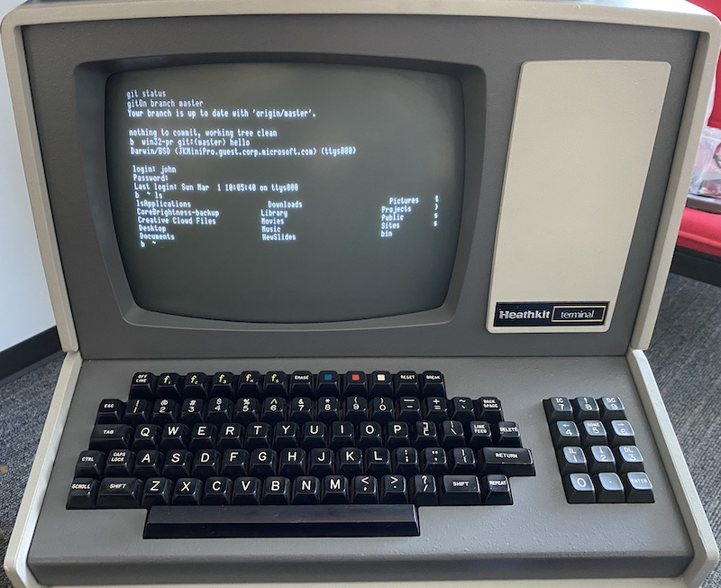

# ExternalTerminal

## Connecting an external terminal to a Mac

It is possible to connect an external terminal to a Mac, and use it to log into the Mac. For example, most vintage terminals use RS232 serial ports to connect, and these can be connected to a Mac via a USB/Serial Dongle. The simplest way to check things are working is to connect the Mac via the USB/Serial Dongle to the terminal, and start a program such as Serial on the Mac. The Serial app will list all the available ports, so select the USB one and connect. Set both systems to the same baud rate and anything you type on the Mac should appear on the terminal, and vice versa.

Note: Not working? Check that you have the right serial cable, and if necessary use a NULL MODEM adaptor to correct the wiring. Still not working? Are you sure the external terminal is working? Cross over the RX and TX pins on the terminal's serial port to see if you get an echo (i.e. with local echo turned off, every keypress should still be displayed on the screen). Confirm baud rates, parity and bit settings are the same. Can't go wrong with 9600N8 and then speed up from there.

## Running the shell on the external terminal

This is where it gets cool: it's possible to get the Mac terminal displayed on the remote terminal. It will be text only, but you can still use git and all your other command line tools.

1. Find the name of the serial port you are using. e.g. the USB dongle. 

You should be able to find it by typing **ls /dev/cu* on the Mac's terminal.

2. Start a secreen session

Enter:

**screen /dev/NAME_OF_YOUR_SERIAL_PORT SPEED**

e.g.

**screen /dev/cu.usbserial-AC00I4ST 9600**

3. Start the shell:

When you launched the screen, the display should have cleared.

3.1 Press **CTRL A** *(nothing appears to happen)*

3.2 Press **:** *(a colon appears at the bottom of the screen)*

3.3 Enter **exec ::: /usr/libexec/getty std.9600** (yes, three colons. You should see a login prompt when you press enter)

Now you can go to the external terminal, and log in with your regular Mac login/password.

When you are finished, enter **CTRL A** and **:** and then enter **Quit** or you'll leave the serial port open.

This has worked for me on a Catalina system, using a USB to Serial dongle, but also with a Serial to BlueTooth adaptor.

## Cleaning up the display

The Mac Terminal will try to send interesting characters to your remote terminal, and some of these may appear as nonsense depending on how smart the terminal is. For really old terminals, I found I had to revert to BASH from ZSH, and then set PROMPT_COMMAND to nothing.

* **chsh -s /bin/bash**
* **PROMPT_COMMAND=""**

